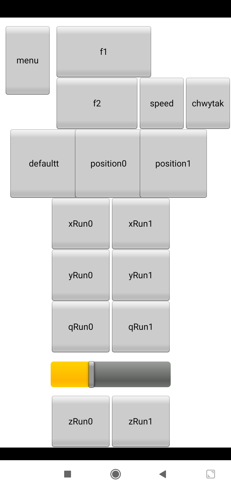

# Robot_Arm

version:4.0

I present the robot arm with five axes. The brain of the arm is Arduino Uno controlled by RoboRemo applications.

### How does the application look:

  

                                                            
### A demonstration of the operation of the function:f1

  

The Necessary Library:
> **Online:** https://github.com/adafruit/Adafruit-PWM-Servo-Driver-Library

